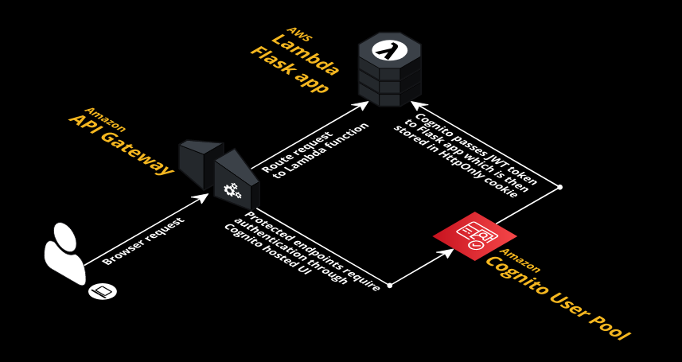

# Flask - AWS Cognito integration example

An example serverless web application using [Flask](https://flask.palletsprojects.com/en/2.0.x/) and [AWS Cognito](https://aws.amazon.com/cognito/) with [JSON Web Tokens (JWT)](https://jwt.io/) to protect specific routes, powered by API Gateway and Lambda.



A high level overview of how the application works is as follows. The Flask application includes a number of blueprints:

* [`home`](src/webapp/home/routes.py): a simple homepage that includes a login link.
* [`auth`](src/webapp/auth/routes.py): login, post-login, and logout routes.
* [`private`](src/webapp/private/routes.py): routes that are only accessible after a user has logged in. If a user is not logged in these routes automatically redirect to the Cognito hosted UI.

When accessing the `/login` route, a user is redirected to the Cognito hosted UI. After successful authentication with the user pool, a JWT is returned to the app through the `/postlogin` endpoint which is stored in a httponly cookie; this cookie is valid for 30 mins and used to authorise access to any routes that are protected with the [`@login_required`](/src/webapp/auth/utils.py) decorator. The app itself uses [Flask-JWT-Extended](https://flask-jwt-extended.readthedocs.io/en/stable/) and [Flask-AWSCognito](https://flask-awscognito.readthedocs.io/en/latest/index.html) to assist with the handling of JWTs to protect specific routes.

For the deployment side, [CDK](https://aws.amazon.com/cdk/) python code is provided in [`/deploy`](/deploy/app.py). The CDK stacks will deploy the Flask application as a [docker container](Dockerfile) to Lambda, with API Gateway in front. A Cognito User Pool is created along with a User Pool Client for the Flask application.

## Getting started

Prequisites:

* [poetry](https://python-poetry.org/)
* [pre-commit](https://pre-commit.com/)
* [AWS CDK](https://aws.amazon.com/cdk/) (v2.15.0)

Setup as follows:

```shell
# setup the python environment with poetry
make install

# Populate the .env file the required parameters
cp .env.example .env
vi .env

# deploy the infra (Cognito, API Gateway, Lambda)
cd deploy
cdk deploy --all

# Populate AWS_COGNITO user pool parameters after deploying
# Obtain these values from the Systems Manager Parameter Store
vi .env

# run locally using Workzeug
make local  # or go to the AWS API Gateway URL

# check other useful commands
make help
```

The [Makefile](Makefile) includes helpful commands for setting up a development environment, get started by installing the package into a new virtual environment and setting up pre-commit with `make install`. Run `make help` to see additional available commands (e.g. linting, testing, docker, and so on).

The application can be run locally through docker (`make docker-build && make docker-run`) or from the installed virtualenv with `make local`. The app should launched at [http://localhost:5000](http://localhost:5000) and a login link should redirect you to the Cognito hosted UI to sign up / sign in. Once logged in, a cookie will store the JWT and you will be redirected to the [`/private`](http://localhost:5000/private) page. You may also view details of the JWT at the [`/token`](http://localhost:5000/token) endpoint.


## Development

* [Pytest](https://docs.pytest.org/en/6.2.x/) is used for the functional tests of the application (see `/tests`).
* Code is linted using [flake8](https://flake8.pycqa.org/en/latest/)
* Code formatting is validated using [Black](https://github.com/psf/black)
* [pre-commit](https://pre-commit.com/) is used to run these checks locally before files are pushed to git
* The [Github Actions pipeline](.github/workflows/pipeline.yml) also runs these checks and tests


## TODO

- [x] CORS
- [X] Serverless deployment with [AWS CDK](https://aws.amazon.com/cdk/)
- [ ] Logout route should also hit the revoke Cognito endpoint
- [ ] Handle JWT authenticated routes in local development (i.e. no Cognito)
- [ ] Populate parameters from SSM at runtime rather than deploy time


## Credits

This project was inspired by the blog post [Integrating Cognito with Flask](https://medium.com/analytics-vidhya/integrating-cognito-with-flask-e00010866054) by Martin Campbell.
